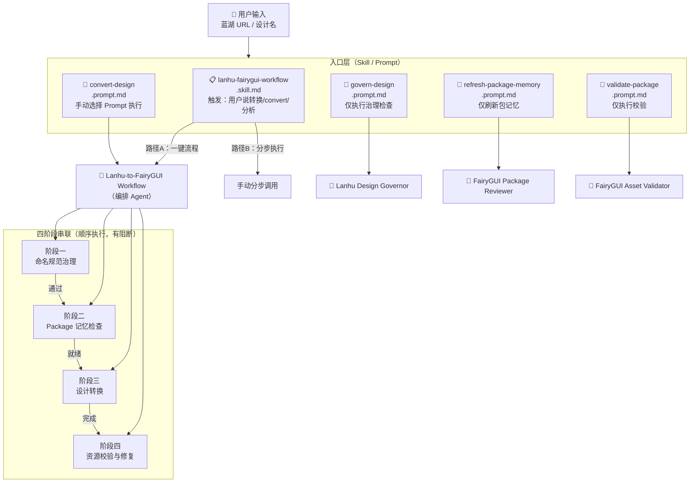
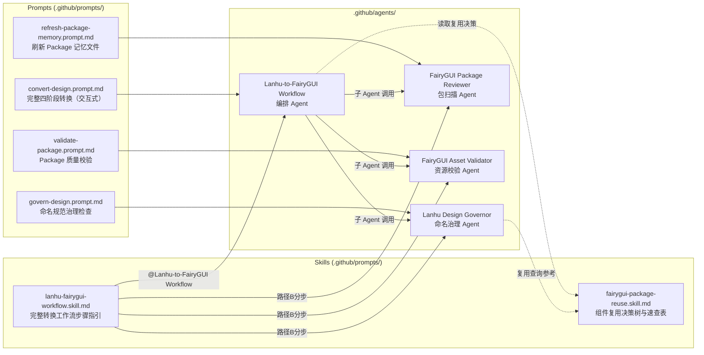
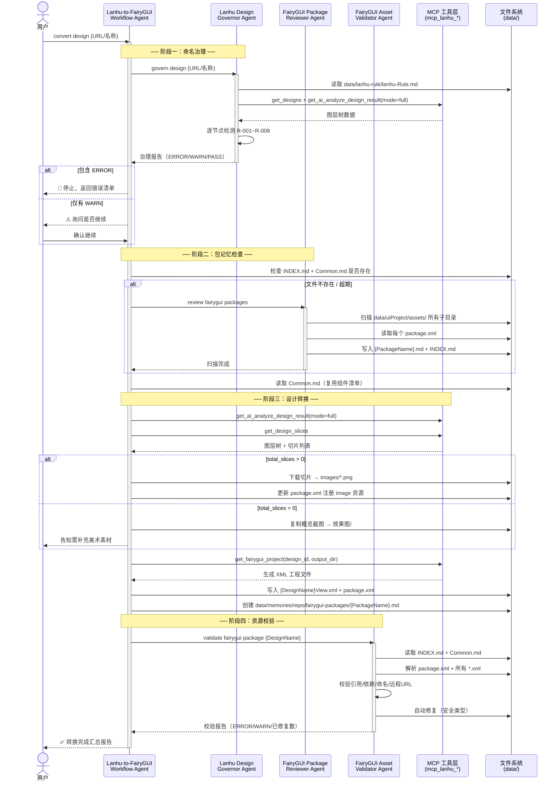
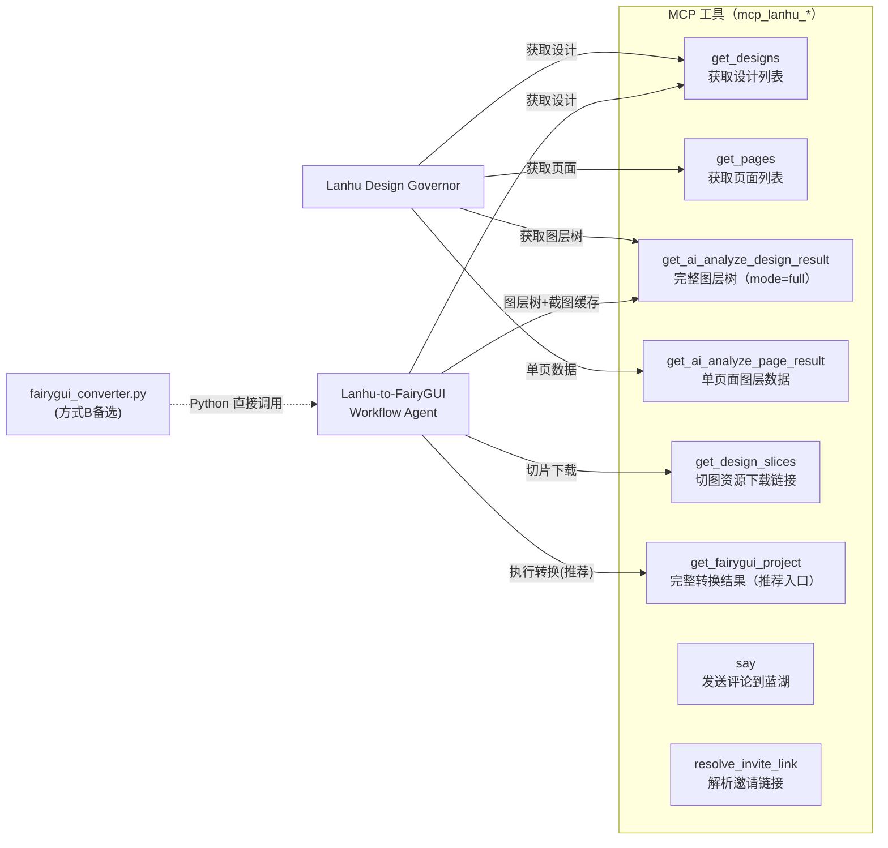
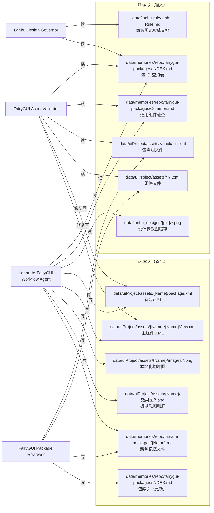
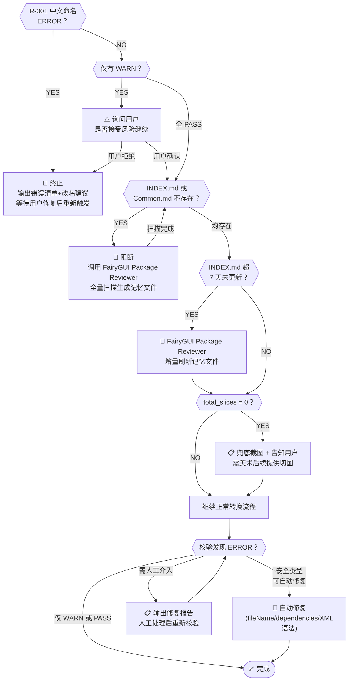
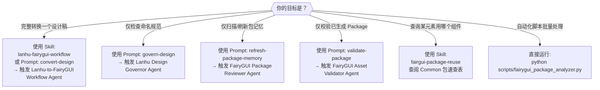

# 蓝湖 → FairyGUI Agent 调度流程图

> 本文档综合分析了 `lanhu-fairygui-workflow.skill.md`、四个 Agent 文件、`fairygui-package-reuse.skill.md` 及各 Prompt 文件，描述完整的 Agent / Skill / Prompt / MCP 工具之间的调度关系。

---

## 1. 总体架构概览

---

## 2. 入口层：Skill + Prompt 触发关系

---

## 3. 编排 Agent 完整四阶段流程

```mermaid
flowchart TD
    START(["▶ 开始\n用户输入设计稿 URL/名称"]) --> PH1_START

    %% ─── 阶段一：命名治理 ───
    subgraph PH1["阶段一：命名规范治理（阻断门控）"]
        PH1_START["📖 读取 data/lanhu-rule/lanhu-Rule.md\n获取权威命名规则 R-001~R-008"]
        PH1_START --> PH1_FETCH["🌐 MCP: mcp_lanhu_lanhu_get_designs\n+ mcp_lanhu_lanhu_get_ai_analyze_design_result\n(mode='full')"]
        PH1_FETCH --> PH1_CHECK["🔍 Lanhu Design Governor\n逐节点检测图层命名规范"]
        PH1_CHECK --> PH1_DECISION{{"检测结果？"}}
        PH1_DECISION -->|"包含 ERROR\n（如 R-001 中文命名）"| PH1_BLOCK["🚫 阻断流程\n输出错误清单 + 改名建议表\n告知用户修复后重新触发"]
        PH1_DECISION -->|"仅有 WARN"| PH1_WARN["⚠️ 列出警告\n询问用户是否接受风险"]
        PH1_DECISION -->|"全部 PASS"| PH2_START
        PH1_WARN -->|"用户确认继续"| PH2_START
        PH1_WARN -->|"用户拒绝"| PH1_BLOCK
    end

    PH1_BLOCK --> END_BLOCK(["⛔ 流程终止"])

    %% ─── 阶段二：Package 记忆检查 ───
    subgraph PH2["阶段二：Package 记忆检查（阻断门控）"]
        PH2_START["📁 检查磁盘文件是否存在\ndata/memories/repo/fairygui-packages/INDEX.md\ndata/memories/repo/fairygui-packages/Common.md"]
        PH2_START --> PH2_EXIST{{"文件是否存在？"}}
        PH2_EXIST -->|"任一不存在"| PH2_SCAN["🚫 阻断 → 调用\nFairyGUI Package Reviewer Agent\n执行全量扫描"]
        PH2_SCAN --> PH2_SCAN_FLOW["扫描 data/uiProject/assets/ 所有包\n读取每个 package.xml\n分析 exported 组件与图片资源\n生成 {PackageName}.md + INDEX.md"]
        PH2_SCAN_FLOW --> PH2_EXIST
        PH2_EXIST -->|"两个文件均存在"| PH2_AGE{{"INDEX.md 是否超过 7 天？"}}
        PH2_AGE -->|"超过 7 天"| PH2_REFRESH["🔄 重新运行\nFairyGUI Package Reviewer\n更新记忆文件"]
        PH2_REFRESH --> PH2_READ
        PH2_AGE -->|"7 天内"| PH2_READ["📖 读取 Common.md\n加载可复用组件清单"]
        PH2_READ --> PH3_START
    end

    %% ─── 阶段三：设计转换 ───
    subgraph PH3["阶段三：设计转换"]
        PH3_START["🌐 3.1 获取设计数据\nmcp_lanhu_lanhu_get_ai_analyze_design_result (mode='full')\nmcp_lanhu_lanhu_get_design_slices"]
        PH3_START --> PH3_SLICE{{"total_slices > 0？"}}

        PH3_SLICE -->|"分支A：有切片"| PH3_DOWNLOAD["⬇️ 遍历 slice_list\n下载切片 → images/*.png\n在 package.xml 注册 <image> 资源"]
        PH3_SLICE -->|"分支B：无切片"| PH3_FALLBACK["📋 兜底：复制设计稿概览截图\ndata/lanhu_designs/{pid}/{name}.png\n→ 效果图/ 目录\n告知用户需美术补充素材"]

        PH3_DOWNLOAD --> PH3_REUSE
        PH3_FALLBACK --> PH3_REUSE

        PH3_REUSE["🔍 3.2 识别可复用组件\n使用 fairygui-package-reuse.skill.md 决策树\n扫描图层树 → 映射 Common 包引用\n(WindowMask/RedDot/Button 等)"]
        PH3_REUSE --> PH3_CONVERT["⚙️ 3.3 执行转换\n方式A（推荐）：mcp_lanhu_lanhu_get_fairygui_project\n方式B：python fairygui_converter.py"]
        PH3_CONVERT --> PH3_OUTPUT["📦 3.4 输出目录结构\nassets/{DesignName}/\n├── package.xml\n├── {DesignName}View.xml\n├── images/\n└── 效果图/"]
        PH3_OUTPUT --> PH3_VALIDATE_LOCAL["✅ 本地检查\n- 所有 fileName 不含 https://\n- 所有 src ID 可解析\n- total_slices=0 时已告知用户"]
        PH3_VALIDATE_LOCAL --> PH3_MEMORY["📝 3.5 创建 Package 记忆文件\ndata/memories/repo/fairygui-packages/{PackageName}.md\n（包ID / 导出组件 / 图片资源 / 跨包依赖 / 技术备注）"]
        PH3_MEMORY --> PH4_START
    end

    %% ─── 阶段四：资源校验 ───
    subgraph PH4["阶段四：资源校验与修复"]
        PH4_START["📖 加载校验规则\n读取 INDEX.md + Common.md\n加载 fairygui-asset-validator.instructions.md"]
        PH4_START --> PH4_PARSE["🔍 解析 package.xml\n构建声明资源映射表\n(id → name/path/exported/scale9grid)"]
        PH4_PARSE --> PH4_DIFF["📂 枚举实际文件\n对比声明 vs 实际文件\n文件存在但未声明 → WARN\n声明但文件不存在 → ERROR"]
        PH4_DIFF --> PH4_COMPONENT["🔬 逐组件深度分析\n- 引用有效性（src/fileName）\n- 跨包依赖声明\n- Common 组件复用检查\n- 远程 URL 检测\n- 命名规范性"]
        PH4_COMPONENT --> PH4_ISSUES{{"发现问题？"}}
        PH4_ISSUES -->|"ERROR（可自动修复）"| PH4_AUTOFIX["🔧 自动修复\n- 修正 fileName 路径\n- 补充 dependencies 声明\n- 修正 XML 标签语法"]
        PH4_ISSUES -->|"ERROR（需人工介入）"| PH4_REPORT["📋 输出修复报告\n列出问题 + 操作建议"]
        PH4_ISSUES -->|"PASS / 仅 WARN"| PH4_SUMMARY
        PH4_AUTOFIX --> PH4_SUMMARY["📊 输出汇总报告\nERROR 数 / WARN 数 / 自动修复数"]
        PH4_REPORT --> PH4_SUMMARY
    end

    PH4_SUMMARY --> DONE(["✅ 转换完成"])
```

---

## 4. 子 Agent 调用关系详图

---

## 5. MCP 工具调用分布

---

## 6. 文件系统读写映射

---

## 7. 关键阻断点与错误处理

---

## 8. 常见错误处理速查

| 现象 | 检测阶段 | 阻断级别 | 自动修复 | 解决方案 |
|------|---------|---------|---------|---------|
| 图层名含中文（R-001） | 阶段一 | 🚫 ERROR | 否 | 设计师改名后重新转换 |
| 图层尺寸 > 1024px（R-002） | 阶段一 | ⚠️ WARN | 否 | 用户确认接受后继续 |
| 组名前缀不合规（R-003） | 阶段一 | ⚠️ WARN | 否 | 建议修正但可跳过 |
| INDEX.md / Common.md 缺失 | 阶段二 | 🚫 阻断 | 是（触发扫描） | 自动调用 Package Reviewer |
| 记忆文件超 7 天 | 阶段二 | ⚠️ 部分阻断 | 是（触发刷新） | 自动重新扫描 |
| 切片为空（total_slices=0） | 阶段三 | ⚠️ 告知 | 是（截图兜底） | 告知用户补充美术素材 |
| fileName 含 https:// | 阶段三/四 | ❌ ERROR | 是 | 下载图片到本地并更新路径 |
| src ID 无法解析 | 阶段四 | ❌ ERROR | 否 | 重新从 package.xml 读取 ID |
| 缺少 dependencies 声明 | 阶段四 | ❌ ERROR | 是 | 自动追加 Common 包 ID |
| XML 使用 `<input>` 标签 | 阶段四 | ❌ ERROR | 是 | 改用 `<text input="true">` |
| exportName 重复（R-008） | 阶段一 | ❌ ERROR | 否 | 重命名冲突图层 |

---

## 9. 调度入口决策树（快速选择）

---

## 10. 文件关系速查表

| 文件路径 | 类型 | 触发/调用 | 被调用关系 |
|---------|------|---------|----------|
| `.github/prompts/lanhu-fairygui-workflow.skill.md` | Skill | 用户意图匹配 | 调用 Workflow Agent、分步调用三个 Sub-Agent |
| `.github/prompts/fairygui-package-reuse.skill.md` | Skill | 转换时需复用决策 | 被 Workflow Agent 和 Governor Agent 参考 |
| `.github/prompts/convert-design.prompt.md` | Prompt | 手动选择执行 | 调用 Workflow Agent（交互式） |
| `.github/prompts/govern-design.prompt.md` | Prompt | 手动选择执行 | 直接调用 Design Governor Agent |
| `.github/prompts/validate-package.prompt.md` | Prompt | 手动选择执行 | 直接调用 Asset Validator Agent |
| `.github/prompts/refresh-package-memory.prompt.md` | Prompt | 手动选择执行 | 直接调用 Package Reviewer Agent |
| `.github/agents/lanhu-to-fairygui.agent.md` | Agent | 编排 | 串联调用其他三个 Sub-Agent + MCP 工具 |
| `.github/agents/lanhu-design-governor.agent.md` | Agent | 阶段一 | 读取 lanhu-Rule.md，调用 MCP 获取设计数据 |
| `.github/agents/fairygui-reviewer.agent.md` | Agent | 阶段二/按需 | 扫描 assets/ 目录，写入记忆文件 |
| `.github/agents/fairygui-asset-validator.agent.md` | Agent | 阶段四 | 读取 package.xml + *.xml，写入修复 |
| `.github/instructions/lanhu-design-governance.instructions.md` | Instructions | `applyTo` 匹配 | 约束 Governor Agent 使用 R-001~R-008 规则 |
| `.github/instructions/fairygui-package-scan.instructions.md` | Instructions | `applyTo` 匹配 | 约束 Reviewer Agent 解析 XML 结构方式 |
| `.github/instructions/fairygui-memory-write.instructions.md` | Instructions | `applyTo` 匹配 | 约束记忆文件写入格式规范 |
| `.github/instructions/fairygui-reuse-in-conversion.instructions.md` | Instructions | `applyTo` 匹配 | 约束转换时优先复用 Common 包 |
| `.github/instructions/fairygui-asset-validator.instructions.md` | Instructions | `applyTo` 匹配 | 提供 Validator 完整校验规则（7 章） |
| `data/lanhu-rule/lanhu-Rule.md` | 规范文档 | 被 Governor 读取 | 命名规范权威来源，动态解析 |
| `data/memories/repo/fairygui-packages/INDEX.md` | 记忆文件 | 被 Workflow/Validator 读取 | 包 ID 快速查询，阻断门控依据 |
| `data/memories/repo/fairygui-packages/Common.md` | 记忆文件 | 被 Workflow/Validator 读取 | 全局复用组件速查，阻断门控依据 |
| `scripts/fairygui_converter.py` | Python 脚本 | 转换备选方式B | 由 Workflow Agent 方式B调用 |
| `scripts/fairygui_package_analyzer.py` | Python 脚本 | 等效于 Reviewer Agent | 批量自动化扫描，生成记忆文件 |
