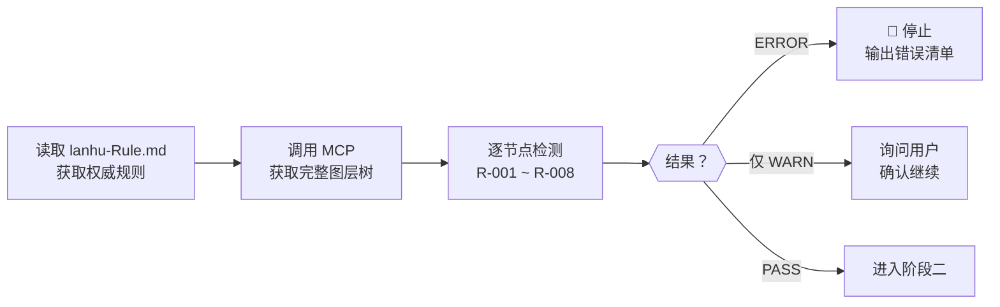

# 用 AI Agent 自动化游戏 UI 工作流
## 蓝湖设计稿 → FairyGUI 工程全链路转换实践

> **技术分享** | 时长约 30 分钟 | 面向：UI 工程师 / 前端开发 / 技术架构

---

## 目录

1. [背景与痛点](#一背景与痛点)
2. [方案设计：MCP + Agent 体系](#二方案设计mcp--agent-体系)
3. [核心架构拆解](#三核心架构拆解)
4. [四阶段工作流详解](#四四阶段工作流详解)
5. [实战演示要点](#五实战演示要点)
6. [经验总结与沉淀](#六经验总结与沉淀)

---

## 一、背景与痛点

### 传统 UI 转换流程

```
设计师出稿（蓝湖）
      ↓
开发手动对稿
      ↓
在 FairyGUI 编辑器里逐层还原
      ↓
切图命名、注册资源
      ↓
联调、对齐偏差
      ↓
重复以上流程（每张设计稿）
```

**每张设计稿平均耗时：2~4 小时**

### 核心痛点

| # | 痛点 | 具体表现 |
|---|------|---------|
| 1 | **重复劳动** | 每次都要手动建 package.xml、登记资源 id |
| 2 | **命名混乱** | 设计稿图层存在中文、命名不规范，转换后报错 |
| 3 | **组件孤岛** | 每个新界面都重新造按钮/弹窗/遮罩，不复用 Common |
| 4 | **质量不稳定** | 生成的 XML 含远程 URL、src ID 猜错、缺跨包依赖声明 |
| 5 | **知识断层** | 老成员知道 Common 包组件，新成员一概不知，重复造轮子 |

### 我们的目标

> **输入一条指令，输出一个可用的 FairyGUI Package**

- 自动检查设计稿命名规范
- 自动扫描现有组件库，确定可复用部分
- 自动生成 XML + 注册资源
- 自动校验生成质量并修复常见问题

---

## 二、方案设计：MCP + Agent 体系

### 为什么选 MCP

**MCP（Model Context Protocol）** 是 Anthropic 提出的开放协议，让 AI 助手可以通过标准接口访问外部数据源和工具。

```
传统：AI → 只能看你告诉它的内容

with MCP：AI → mcp_lanhu_get_designs() → 实时蓝湖数据
             → mcp_lanhu_get_ai_analyze_design_result() → 图层树
             → mcp_lanhu_get_design_slices() → 切图资源
```

**关键优势**：AI 不是在猜，而是在**实时读取真实数据**。

### 为什么选 VS Code Agent 模式

- **Skills**：打包领域知识，触发匹配（类似函数签名）
- **Prompts**：可交互的执行入口，带参数输入
- **Agents**：有工具权限的执行者，可调用文件系统、终端、MCP
- **Instructions**：约束代码生成行为（applyTo 文件范围）

```
用户一句话 → Skill 识别意图 → 选择路径 A 或路径 B
                                ↓
                       Workflow Agent 编排
                          ↓   ↓   ↓   ↓
                     4 个专项 Sub-Agent 接力执行
```

### 整体技术栈

```
┌─────────────────────────────────────────────────┐
│  VS Code Copilot Agent 模式                      │
│  Skills / Prompts / Agents / Instructions        │
└──────────────────┬──────────────────────────────┘
                   │ MCP Protocol (stdio)
┌──────────────────▼──────────────────────────────┐
│  lanhu_mcp_server.py（FastMCP 框架）             │
│  封装蓝湖 API + 截图 + 缓存                      │
└──────────────────┬──────────────────────────────┘
                   │
┌──────────────────▼──────────────────────────────┐
│  fairygui_converter.py                          │
│  Lanhu Schema → FairyGUI XML                    │
└─────────────────────────────────────────────────┘
```

---

## 三、核心架构拆解

### 3.1 文件体系全图

```
.github/
├── agents/
│   ├── lanhu-to-fairygui.agent.md      ← 编排 Agent（总指挥）
│   ├── lanhu-design-governor.agent.md  ← 命名治理专项
│   ├── fairygui-reviewer.agent.md      ← 包扫描专项
│   └── fairygui-asset-validator.agent.md ← 质量校验专项
│
├── prompts/
│   ├── lanhu-fairygui-workflow.skill.md  ← 触发入口（Skill）
│   ├── fairygui-package-reuse.skill.md   ← 复用决策树（Skill）
│   ├── convert-design.prompt.md          ← 交互式转换 Prompt
│   ├── govern-design.prompt.md           ← 仅治理 Prompt
│   ├── validate-package.prompt.md        ← 仅校验 Prompt
│   └── refresh-package-memory.prompt.md  ← 刷新记忆 Prompt
│
└── instructions/
    ├── lanhu-design-governance.instructions.md    ← 约束治理行为
    ├── fairygui-package-scan.instructions.md      ← 约束扫描解析
    ├── fairygui-memory-write.instructions.md      ← 约束记忆格式
    ├── fairygui-reuse-in-conversion.instructions.md ← 约束复用行为
    └── fairygui-asset-validator.instructions.md   ← 完整7章校验规则
```

### 3.2 三种文件类型的分工

| 类型 | 触发方式 | 有工具权限 | 典型职责 |
|------|---------|-----------|---------|
| **Skill** | 语义匹配（自动） | 否 | 提供决策树、速查表、流程指引 |
| **Prompt** | 用户手动选择 | 是（agent 模式下） | 有输入参数的完整执行入口 |
| **Agent** | 被 Workflow 或 Prompt 调用 | 是 | 专项执行，读写文件/调用 API/运行命令 |
| **Instructions** | applyTo 文件匹配（自动注入） | 否 | 约束代码生成的规范和格式 |

### 3.3 两个关键设计决策

**决策一：引入"记忆文件"机制**

不是每次都扫描 XML，而是把扫描结果持久化为 Markdown：

```
data/memories/repo/fairygui-packages/
├── INDEX.md        ← 所有包的 ID 快速索引
├── Common.md       ← 通用组件完整速查（最重要）
├── Hero.md
├── MainUI.md
└── ...
```

好处：
- 查询 O(1)，无需每次解析几十个 XML
- 记忆文件可以人工修正和补充注释
- 7天过期机制确保数据新鲜度

**决策二：门控阻断（Gate Control）**

不是发现问题就跳过，而是**强制阻断**等待修复：

```
命名治理 → 有 ERROR？→ 🚫 停止（不可绕过）
                                  ↑
           设计师必须在蓝湖修改图层名再触发
```

这是工程实践中最重要的质量保证——**把问题消灭在源头**。

---

## 四、四阶段工作流详解

### 阶段一：命名规范治理

**目的**：提前发现 7 类命名问题，阻止带病转换



**核心规则速查**：

| 规则 | 检测项 | 级别 | 示例 |
|------|--------|------|------|
| R-001 | 图层名含中文 | ERROR | `背景图层` → 必须英文 |
| R-002 | 图层尺寸 > 1024px | WARN | 须确认无透明通道需求 |
| R-003 | 组名缺规范前缀 | WARN | `btn_ok` → 应为 `Btn$ok` |
| R-004 | 语义后缀拼写错误 | ERROR | `@icon` 应为 `@icons` |
| R-005 | 9宫格参数格式错误 | ERROR | `@9#` 后须跟 `l_t_r_b` |
| R-006 | 多后缀顺序错误 | ERROR | 须先 `@9#参数` 后 `@bar` |
| R-008 | 导出文件名重复 | ERROR | 同层级下 stem 相同 |

> **设计原则**：治理规则单一来源 —— `data/lanhu-rule/lanhu-Rule.md`，Agent 每次动态读取，永不依赖缓存。

---

### 阶段二：Package 记忆检查

**目的**：确保复用信息就绪，避免 src ID 引用错误

```
检查流程：

1. INDEX.md 存在？
   └── NO → 调用 FairyGUI Package Reviewer 全量扫描（自动阻断）
   └── YES → 继续

2. Common.md 存在？
   └── NO → 同上，必须先扫描
   └── YES → 继续

3. INDEX.md 更新时间 ≤ 7 天？
   └── 超期 → 重新扫描（增量更新）
   └── 有效 → 读取 Common.md，进入阶段三
```

**FairyGUI Package Reviewer 做了什么**：

```python
# 伪代码：批量扫描
for package_dir in assets/:
    pkg_id = package.xml → <packageDescription id="...">
    
    for resource in package.xml:
        if resource.exported == "true":
            记录 id, name, path, type, scale9grid
    
    for component_file in *.xml:
        分析 size, extention, controller, displayList
    
    写入 data/memories/repo/fairygui-packages/{Name}.md
```

**Common.md 记录样例**：

```markdown
## WindowMask
- **ID**: douy3
- **尺寸**: 720×1280
- **文件**: WindowMask.xml
- **用途**: 全屏半透明黑色遮罩
- **触发条件**: 图层名含 mask/overlay，全屏尺寸

## BCommonConfirmBtn
- **ID**: klomijo62q
- **尺寸**: 282×81
- **文件**: new/Button/BCommonConfirmBtn.xml
- **用途**: 主要确认操作按钮（实心橙色）
```

---

### 阶段三：设计转换（核心）

#### 3.1 获取设计数据

```python
# 两个 MCP 工具并行调用
design_data = mcp_lanhu_lanhu_get_ai_analyze_design_result(
    design_id="xxx", 
    mode="full"        # 获取完整图层树，同时触发截图缓存
)
slices = mcp_lanhu_lanhu_get_design_slices(design_id="xxx")
```

#### 3.2 切片资源处理（两个分支）

```
slices.total_slices > 0？
│
├── YES（有切片）
│   遍历 slice_list → 下载到 images/*.png
│   在 package.xml 注册 <image> 资源
│
└── NO（无切片——蓝湖未配置导出）
    复制概览截图 → 效果图/ 目录（兜底预览）
    告知用户：美术需补充切图到 images/
```

#### 3.3 复用决策树（关键！）

在开始生成 XML **之前**，先扫描图层树，找出可复用的 Common 组件：

```
设计元素分析
      │
      ├── 全屏遮罩？     → src="douy3"     WindowMask.xml
      ├── 红点角标≤30px？→ src="pxfbo4hc"  reddot/RedDot.xml
      ├── 主确认按钮？   → src="klomijo62q" new/Button/BCommonConfirmBtn.xml
      ├── 取消按钮？     → src="klomijo62o" new/Button/BCommonCanelBtn.xml
      ├── 加载转圈？     → src="douya"      ModalWaiting.xml
      └── 其他 → 查 Common.md → 找到用复用，找不到新建
```

**严格约束**：表中未列的 ID，必须从 `Common.md` 读取，**严禁猜测 src ID**。

#### 3.4 XML 生成规范

```xml
<!-- 跨包组件引用格式（必须同时有 src + fileName）-->
<component id="n1" name="mask"
           src="douy3" fileName="WindowMask.xml"
           xy="0,0" size="720,1280">
  <relation target="" sidePair="width-width,height-height"/>
</component>

<!-- 文本输入框（注意：禁止用 <input> 标签）-->
<text id="n2" name="inputName"
      input="true" prompt="请输入昵称"
      xy="50,100" size="300,60"
      fontSize="28" color="#333333"/>
```

#### 3.5 转换后必须创建 Package 记忆文件

```markdown
# 路径：data/memories/repo/fairygui-packages/{PackageName}.md

## 包基本信息
- **包 ID**: abc123
- **来源设计 pid**: 692df797-ae25-4b64-8850-6b240fa68d19

## 导出组件
| 组件名 | ID | 尺寸 | 说明 |
...

## 图片资源
| 文件名 | ID | 九宫格 | 是否需美术补充 |
...

## 跨包依赖
- Common 包 (yez16kc6)：WindowMask、RedDot、BCommonConfirmBtn
```

---

### 阶段四：资源校验与修复

**目的**：兜底审计，发现生成质量问题，自动修复安全类型

**校验维度（7 章规则）**：

```
1. 设计一致性    → 尺寸/颜色/字体与蓝湖一致（允差 ±2px）
2. 资源注册完整性 → 文件存在但未声明/声明但文件不存在
3. 组件引用有效性 → src ID 可解析，fileName 文件存在
4. 跨包依赖声明  → 引用了 Common 包，dependencies 要声明
5. 远程 URL 检测 → fileName 不能含 https://
6. 命名规范校验  → 组件/资源命名符合 FairyGUI 命名规范
7. XML 语法正确性 → 无无效标签（如 <input>），编码 UTF-8
```

**自动修复范围**（安全操作）：

| 问题 | 自动修复方式 |
|------|------------|
| 缺少 dependencies 声明 | 追加 Common 包 ID `yez16kc6` |
| fileName 含 https:// | 提示下载 + 替换为本地路径 |
| 使用 `<input>` 标签 | 替换为 `<text input="true">` |
| fileName 格式错误 | 修正为 `PackageName/path/file.xml` |

---

## 五、实战演示要点

### 演示路径（推荐步骤）

```bash
# 1. 用户触发（Copilot 对话框输入）
"把蓝湖设计稿 [URL] 转成 FairyGUI"

# 2. Skill 自动识别意图，触发 Workflow Agent
# → 依次进入四个阶段，每阶段有明确日志输出

# 3. 最终查看生成产物
data/uiProject/assets/{DesignName}/
├── package.xml
├── {DesignName}View.xml
├── images/
└── 效果图/
```

### 演示要观察的关键节点

1. **阶段一阻断**：故意设计一张含中文图层名的设计稿，演示阻断效果
2. **记忆文件驱动复用**：打开 `Common.md`，展示它如何指导 XML 生成
3. **切片分支**：对比 `total_slices=0` 时的兜底处理
4. **校验自动修复**：展示 `dependencies` 声明自动追加

### 重点演示文件

```
打开：.github/agents/lanhu-to-fairygui.agent.md
  → 展示编排 Agent 如何设计四阶段阻断门控

打开：data/memories/repo/fairygui-packages/Common.md
  → 展示记忆文件的结构和内容

打开：data/uiProject/assets/{任意Package}/{View}.xml
  → 展示跨包组件引用的 src + fileName 格式
```

---

## 六、经验总结与沉淀

### 成效

| 指标 | 之前 | 之后 |
|------|------|------|
| 单张设计稿转换时间 | 2~4 小时 | 5~15 分钟 |
| 命名问题发现时机 | 转换后报错才发现 | 转换前门控阻断 |
| Common 组件误创率 | 约 30%（不知道有现成的） | 趋近 0%（记忆文件驱动） |
| 生成 XML 含远程 URL | 常见 | 自动检测 + 报错 |
| 新成员上手门槛 | 需要老成员口传 | 查 Common.md 即可 |

### 三个关键工程模式

**1. 单一真理源（Single Source of Truth）**

> 命名规则只在 `lanhu-Rule.md` 里，Agent 每次动态读取，不允许在 Instructions 里维护副本。

**2. 知识外化（Knowledge Externalization）**

> 把隐性的"哪些组件可以复用"知识写成 `Common.md`，变成机器可查询的结构化数据，而不是只活在老员工脑子里。

**3. 门控 > 容错（Gate > Tolerance）**

> 与其在生成后修复问题，不如在源头阻断。R-001 中文命名是强制 STOP，不允许"忽略错误继续执行"的逃逸口。

### 可进一步扩展的方向

```
当前：蓝湖 → FairyGUI XML（静态布局）
         ↓
可扩展：
  • 自动生成 Laya3 TypeScript 绑定代码（GenAutoBinding）
  • 对接 CI/CD：设计稿更新触发自动重新转换 + PR
  • 多设计工具接入：Figma / MasterGo MCP 适配
  • 历史版本 diff：设计稿迭代时只转换变更的部分
```

### 给同类项目的建议

1. **先建规范，再建工具**：没有 `lanhu-Rule.md` 这样的规范文档，Agent 无从约束
2. **记忆文件是 ROI 最高的投入**：一次扫描，永久复用，定期刷新
3. **阻断要狠，修复要全**：ERROR 必须阻断，WARN 询问，自动修复要覆盖所有高频问题
4. **Instructions 约束范围要精准**：`applyTo` 模式匹配不准会让规则失效

---

## 附录：快速参考卡

### MCP 工具速查

| 工具 | 用途 | 关键参数 |
|------|------|---------|
| `get_designs` | 获取设计列表 | — |
| `get_pages` | 获取页面列表 | `design_id` |
| `get_ai_analyze_design_result` | 完整图层树 | `design_id`, `mode="full"` |
| `get_design_slices` | 切图下载链接 | `design_id` |
| `get_fairygui_project` | 完整转换（推荐） | `design_id`, `output_dir` |

### 常见报错与解决

| 报错现象 | 原因 | 解法 |
|---------|------|------|
| XML NullReferenceException | 使用了 `<input>` 标签 | 改为 `<text input="true">` |
| src ID 无法解析 | 猜测了不存在的 ID | 从 `package.xml` 或记忆文件重新读取 |
| 缺少依赖声明 | 跨包引用未在 publish 声明 | 追加 `yez16kc6`（Common 包 ID） |
| 图片不显示 | fileName 为远程 URL | 下载到本地 `images/` 目录 |
| 组件尺寸偏移 | 坐标系差异 | 检查 `left/top` 是否为绝对坐标 |

### Copilot 触发指令速查

| 目标 | 触发方式 |
|------|---------|
| 完整转换一张设计稿 | `"把蓝湖设计稿 [URL] 转成 FairyGUI"` 或选择 `convert-design` Prompt |
| 仅做命名检查 | 选择 `govern-design` Prompt |
| 仅刷新包记忆 | 选择 `refresh-package-memory` Prompt |
| 仅校验已有 Package | 选择 `validate-package` Prompt |
| 查找某元素用哪个组件 | 触发 `fairygui-package-reuse` Skill |

---

# 感谢聆听！扫码提交您的宝贵建议

